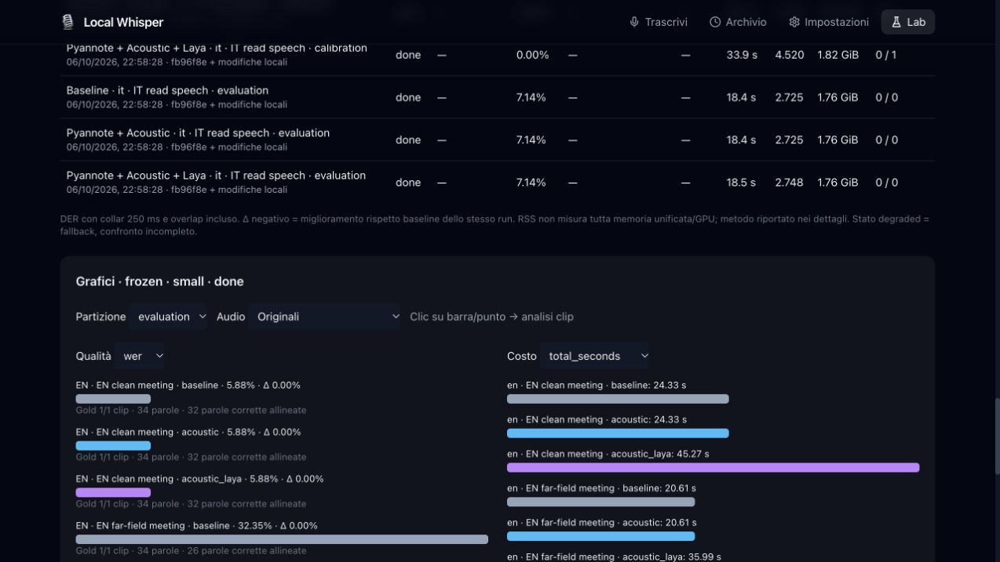

# Verifica suite pubblica — 6 ottobre 2026

Branch `benchmark-lab`. Run finale `0481096886d6450a98e719079d5b2c8f`: **done**, 36 risultati su 12 clip, 111.95 s audio, **516.1 s / 1800 s** esecuzione.

Suite locale: **59.79 min**, 298 clip canonici (32 AMI + 266 VoxForge originali/degradati), 29.60 min EN + 30.19 min IT. 14 contributori italiani, 4 calibrazione / 10 valutazione; AMI ES2002/ES2003 separati. Disco Lab corrente: **126.38 MB / 2000 MB**, include vecchi smoke, ritagli, cache e report; modelli già installati esclusi. Downloader/transcodifica riservano spazio prima delle scritture, file singoli e ripresa Range; nessun archivio/audio sorgente rimasto dopo preparazione.

## Qualità

Nessuna correzione speaker; nessun miglioramento o peggioramento rispetto baseline nei confronti congelati. WER e DER grezzo Pyannote invariati per costruzione. Tutti 36 risultati ricalcolati con revisione scoring `fixed-baseline-word-mapping+matched-partial-UEM-v2`: stessi valori in questo smoke, delta qualità zero. Metriche precedenti conservate, snapshot immutabili intatti, nessuna nuova inferenza. DER prodotto usa mapping ottimale del protocollo DER; WDER/diagnostica mantengono identità baseline, evitando miglioramenti apparenti da permutazioni globali. UEM parziale filtra parole gold e ipotesi temporizzate con stesso criterio midpoint; gold senza timestamp richiede testo riferito al clip completo.

| Lingua / split | Parole gold | WER | DER prodotto | WDER | Gold WER/DER/WDER |
| --- | ---: | ---: | ---: | ---: | --- |
| EN / calibration | 103 | 34.95% | 25.33% | 10.14% | 2/2/2 clip |
| EN / evaluation | 68 | 19.12% | 19.98% | 0.00% | 2/2/2 clip |
| IT / calibration | 49 | 4.08% | — | — | 4/0/0 clip |
| IT / evaluation | 52 | 5.77% | — | — | 4/0/0 clip |

Conteggi sommati, nessuna media di percentuali. Microfoni e copie correlate: tabella smoke, non evidenza statistica indipendente. Dati originali/degradati e scenari separati nei grafici e nel JSON/CSV. Italiano WER soltanto: nessun gold speaker VoxForge, nessuna conclusione su conversazioni italiane. AMI parole manuali e intervalli trascrittore, collar 250 ms e overlap incluso: protocollo distinto da SAD ufficiale. Campioni brevi, normale resa ASR variabile; calibrazione non usata per certificare miglioramenti.

## Costo e decisioni

| Variante | Refiner aggiunto | Peak RSS massimo | Astensioni | Correzioni |
| --- | ---: | ---: | ---: | ---: |
| baseline | 0.000 s | 1.819 GiB | 0 | 0 |
| acoustic | 0.005 s | 1.819 GiB | 10 | 0 |
| acoustic_laya | 148.465 s | 1.819 GiB | 9 | 0 |

Laya: 10 decisioni semantiche; 1 proposta accettata che conferma speaker originale, zero correzioni. Un worker alla volta, profilo leggero 2 thread / 8 GiB RSS; ASR balanced, Community-1. Somma preparazioni: 237.09 s. Tempo equivalente nei grafici = preparazione condivisa + replay; tempo reale budget include subprocess startup e scoring. RSS esclude parte memoria GPU/unificata, cache filesystem OS non controllata. Nessuna simulazione altro hardware.

## Verifiche

- 100 test Python, 2 test frontend, build Vite riusciti; controllo sintassi `.sh`, compilazione Python e `git diff --check` passati.
- Test download interrotto/ripresa/hash/budget, AMI/VoxForge/ELAN, ritagli/UEM/anonimizzazione, selezioni riproducibili, deduplica, snapshot immutabile/invalidation, mapping WDER fisso, gold incompleto, aggregazioni, persistenza, Range, export e gate/cancel.
- Timeout reale: run `7f56a1c40f004c1e8116fd6fa051081c`, limite 10 s, stato partial dopo 10.22 s; nessun worker ASR/Pyannote/Laya residuo. Risultati completati preservati verificati anche tramite test API.
- Verifica UI: catalogo, selezione Media, grafici gold/mancanti, clic grafico → dettaglio, audio riprodotto (readyState 4, nessun errore), seek intervallo 10.5–12 s corretto. JSON/CSV esportati localmente.

## Limiti e seguito

TIGR: Start download conduce al login SWISSUbase, accesso non operativo. Import ELAN disponibile con tier espliciti, esclusioni per nomi silenziati e conferma revisione anonimizzazione; sostituzione parte italiana della suite supportata. Nessun video scaricato. Conversazioni IT reali, stress rumorosi reali aggiuntivi e verifica completa finalisti rimangono successivi; modalità completa baseline + un finalista / fino 3 ripetizioni implementata, non eseguita durante smoke. LibriCSS/CHiME/DiPCo e nuovi modelli non scaricati.

Baseline resta scelta prudente: Laya aggiunge costo senza beneficio misurato in questo smoke. Occorrono campioni held-out conversazionali più ampi e calibrazione separata per valutare eventuali soglie/contesto alternativi.

Artefatti locali: `lab-data/reports/public-smoke.json`, `lab-data/reports/public-smoke.csv`; tutti audio/reference/config/snapshot/log nel Lab ignorato da Git.

